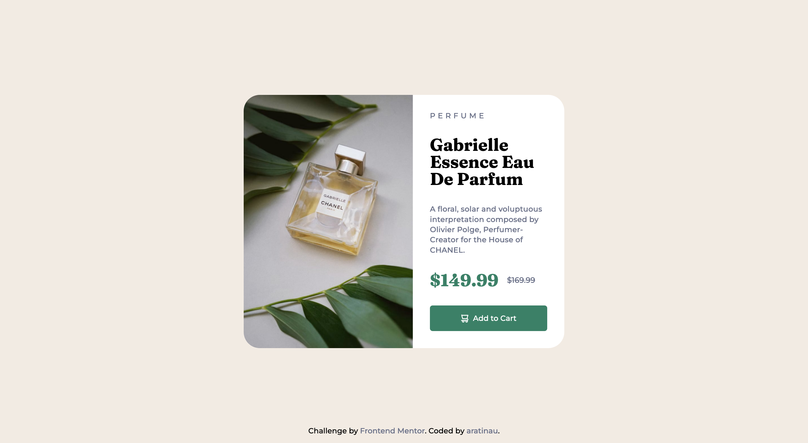

# Frontend Mentor - Product preview card component solution

This is a solution to the [Product preview card component challenge on Frontend Mentor](https://www.frontendmentor.io/challenges/product-preview-card-component-GO7UmttRfa). Frontend Mentor challenges help you improve your coding skills by building realistic projects.

## Table of contents

- [Overview](#overview)
    - [The challenge](#the-challenge)
    - [Screenshot](#screenshot)
    - [Links](#links)
- [My process](#my-process)
    - [Built with](#built-with)
    - [What I learned](#what-i-learned)

## Overview

### The challenge

Users should be able to:

- View the optimal layout depending on their device's screen size
- See hover and focus states for interactive elements

### Screenshot



### Links

[Demo](https://your-live-site-url.com)

## My process

### Built with

- Semantic HTML5 markup
- Flexbox

**Note: These are just examples. Delete this note and replace the list above with your own choices**

### What I learned

I am proud of the way I used ` position:absolute` and `flex` in the container

```css
.container {
  width: 600px;
  background: hsl(var(--white));
  border-radius: 30px;

  display: flex;
  justify-content: center;

  position: absolute;
  top: 50%;
  right: 50%;
  transform: translate(50%,-50%);
}
```

I have isolated this part in a codepen https://codepen.io/aratinau/pen/zYJLweL
